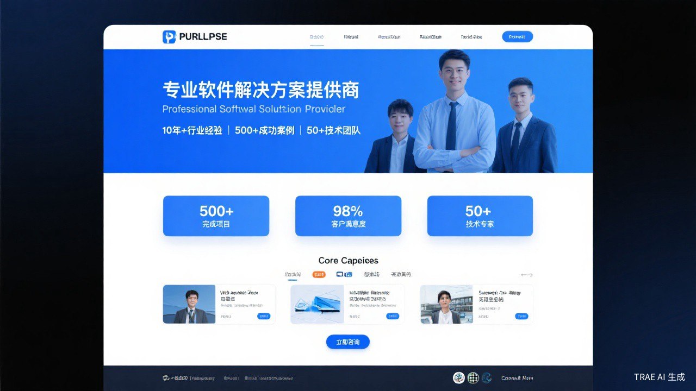
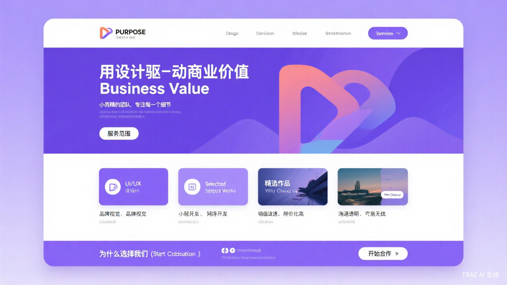
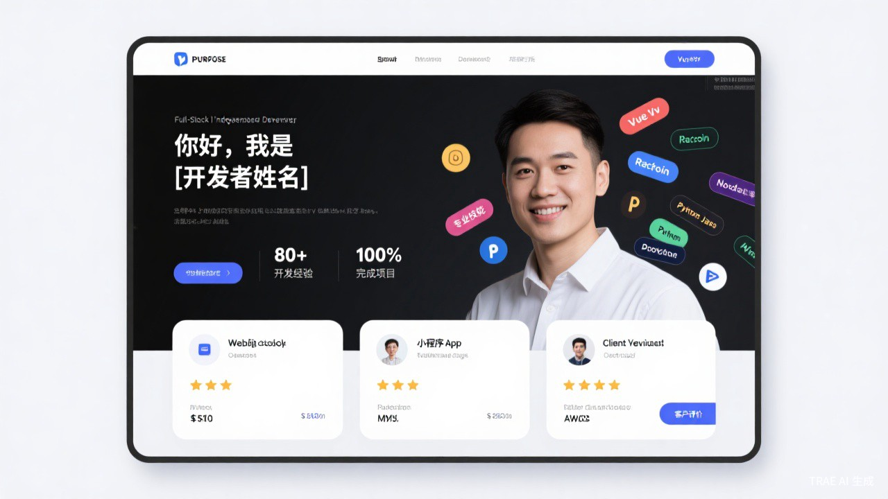

# 团队能力展示（Team Showcase）功能设计文档

> 版本：v1.0  
> 日期：2026-04-25  
> 状态：待审阅

---

## 一、需求背景

用户在接单过程中发现：千元级订单客户决策链短、对资质要求低；但万元以上的订单客户对团队资质、项目经验、成功案例要求显著提高。当前「团队专属全自动 Agent 链接」页面（`/quick-quote/{slug}`）仅提供项目创建功能，缺少团队展示能力，无法在客户首次接触时建立信任。

**目标**：在 Agent 链接页面中嵌入「团队能力展示」板块，让客户在创建报价前快速了解团队实力，提升万元级订单的转化率。

---

## 二、功能概述

在 `/quick-quote/{slug}` 公开页面中新增可配置的「团队能力展示」区域，位于页面顶部（表单上方），作为客户的第一视觉焦点。

管理员可在系统设置中：
1. **开启/关闭**展示板块
2. **选择官方模板**（企业版 / 工作室版 / 个人版），填写内容后自动渲染
3. **上传自定义 HTML 源代码**，实现完全自定义的展示页面

---

## 三、页面布局设计

### 3.1 整体页面结构（改造后）

**核心设计原则**：客户打开页面后，必须在 **3 秒内** 看到「需求梳理」入口。展示区可以丰富，但转化入口绝不能被淹没。

```
┌──────────────────────────────────────────────────────┐
│  [固定顶栏]  团队Logo/名称    [立即需求梳理 ▶] 按钮    │
│              （始终可见，不随页面滚动消失）               │
├──────────────────────────────────────────────────────┤
│  团队能力展示区（新增，可配置/可关闭）                    │
│  ┌────────────────────────────────────────────────┐  │
│  │  模板渲染 / 自定义HTML                            │  │
│  │  - 团队名称、简介                                 │  │
│  │  - 核心数据（项目数、满意度等）                     │  │
│  │  - 能力标签 / 技术栈                              │  │
│  │  - 成功案例展示                                   │  │
│  │  - 联系方式                                       │  │
│  │                                                  │  │
│  │  ┌──────────────────────────────────────┐       │  │
│  │  │  💡 了解了？立即开始需求梳理 →          │       │  │
│  │  └──────────────────────────────────────┘       │  │
│  └────────────────────────────────────────────────┘  │
├──────────────────────────────────────────────────────┤
│  快速创建报价（原有表单卡片）                           │
│  ┌────────────────────────────────────────────────┐  │
│  │  品牌标识: [团队名称]                            │  │
│  │  项目名称: [___________]                        │  │
│  │  报价模式: ○ 单体  ○ 解决方案                     │  │
│  │  [开始需求梳理] ← 按钮文案统一为"需求梳理"         │  │
│  └────────────────────────────────────────────────┘  │
└──────────────────────────────────────────────────────┘
```

### 3.2 「需求梳理」入口的三重保障（3 秒可达）

为确保客户在任何浏览深度下都能在 3 秒内找到转化入口，采用**三重入口**设计：

| 入口 | 位置 | 形式 | 行为 |
|------|------|------|------|
| **① 固定顶栏按钮** | 页面最顶部，始终可见 | 醒目的主色按钮「立即需求梳理 ▶」 | 点击后平滑滚动到表单区域，并自动聚焦项目名称输入框 |
| **② 展示区内嵌 CTA** | 团队展示区底部 | 引导性横幅「了解了？立即开始需求梳理 →」 | 点击后滚动到表单区域 |
| **③ 表单提交按钮** | 表单卡片底部（原有位置） | 「开始需求梳理」按钮 | 原有逻辑不变，直接提交表单 |

**为什么需要三重入口**：
- 入口 ① 解决「展示内容很长，表单不在首屏」的问题 — 固定顶栏永远可见
- 入口 ② 解决「用户认真看完展示内容后需要即时转化」的问题 — 就地转化，无需回找
- 入口 ③ 解决「用户直接滚动到表单」的原有路径 — 保持不变

### 3.3 固定顶栏详细设计

```
┌─────────────────────────────────────────────────────────┐
│  🏢 流帮科技                              [立即需求梳理 ▶] │
│  ─────────────────────────────────────────────────────── │
│  （顶栏高度: 56px，背景: 白色/半透明毛玻璃，阴影分离）     │
│  （滚动后顶栏变为固定定位 position: sticky; top: 0）      │
└─────────────────────────────────────────────────────────┘
```

**交互细节**：
- **初始状态**：顶栏随页面正常流动，位于展示区顶部
- **滚动后**：顶栏吸附在视口顶部（`position: sticky; top: 0`），始终可见
- **按钮样式**：主色填充按钮（`#667eea`），带右箭头图标，视觉权重最高
- **点击行为**：`scrollIntoView({ behavior: 'smooth' })` 平滑滚动到表单，然后 `input.focus()` 自动聚焦
- **移动端**：按钮文案缩短为「需求梳理 ▶」，保证不换行

### 3.4 展示区内嵌 CTA 详细设计

位于团队展示区底部，在所有展示内容之后、表单之前：

```
┌──────────────────────────────────────────────────┐
│  💡 了解了我们的实力？                              │
│  立即开始需求梳理，AI 帮您智能拆解项目 →              │
│                                                  │
│  [开始需求梳理]  （次级按钮样式，与表单按钮呼应）      │
└──────────────────────────────────────────────────┘
```

**设计要点**：
- 使用浅色背景卡片（如 `#f0f0ff`）与展示区内容区分
- 文案引导性强：「了解了我们的实力？」暗示用户已充分了解
- 按钮使用次级样式（描边按钮），与表单的主按钮形成主次关系

### 3.5 表单按钮文案统一

将原有按钮文案从「创建 AI 需求分析会话」改为「开始需求梳理」：

| 改动前 | 改动后 | 原因 |
|--------|--------|------|
| 创建 AI 需求分析会话 | **开始需求梳理** | 更简洁直白，降低客户理解成本；与顶栏/内嵌 CTA 文案统一，强化品牌记忆 |

### 3.6 展示区与表单的视觉关系

- 展示区采用**全宽布局**，作为页面的 Hero Section
- 表单卡片保持**居中窄卡片**（max-width: 460px），位于展示区下方
- 展示区底部与表单之间保持适当间距（40px）
- 整体保持紫色渐变背景的视觉一致性
- **新增**：固定顶栏采用白色/半透明毛玻璃效果，与紫色渐变背景形成层次对比

---

## 四、配置模式设计

### 4.1 三种模式

| 模式 | 说明 | 适用场景 |
|------|------|---------|
| **关闭** | 不展示任何团队能力信息，页面仅显示表单 | 不需要展示的团队 |
| **官方模板** | 选择预设模板，填写结构化内容，系统自动渲染 | 大多数团队 |
| **自定义HTML** | 上传完整的 HTML 源代码，iframe 嵌入渲染 | 有前端能力的团队 |

### 4.2 官方模板内容字段

三套模板共享相同的数据结构，仅视觉风格不同：

```json
{
  "mode": "template",
  "templateId": "enterprise | studio | freelancer",
  "teamName": "流帮科技",
  "slogan": "专业软件解决方案提供商",
  "description": "10年+行业经验，专注为企业提供数字化转型服务...",
  "stats": [
    { "label": "完成项目", "value": "500+" },
    { "label": "客户满意度", "value": "98%" },
    { "label": "技术专家", "value": "50+" }
  ],
  "capabilities": [
    { "icon": "web", "title": "Web应用开发", "desc": "企业级Web系统" },
    { "icon": "mobile", "title": "移动端开发", "desc": "iOS/Android" }
  ],
  "cases": [
    { "title": "某大型电商平台", "industry": "电商", "desc": "全栈重构..." }
  ],
  "techStack": ["Vue.js", "React", "Java", "Python"],
  "contactInfo": {
    "email": "contact@example.com",
    "phone": "138xxxx",
    "wechat": "example_wx"
  }
}
```

### 4.3 自定义 HTML 模式

- 管理员在配置页中粘贴完整的 HTML 源代码（支持内联 CSS 和 `<style>` 标签）
- 前端通过 **iframe**（`srcdoc`）渲染，确保样式隔离
- 系统自动注入团队名称变量 `{{teamName}}`，支持动态替换
- 安全限制：禁用 `<script>` 标签（XSS 防护），仅允许静态 HTML + CSS

---

## 五、官方模板设计

### 5.1 企业版模板（enterprise）

**目标用户**：有一定规模的技术公司、软件外包企业

**视觉风格**：
- 主色调：专业蓝（`#1e40af` / `#3b82f6`）
- 布局：宽幅 Hero + 数据卡片 + 能力矩阵 + 案例展示
- 氛围：稳重、专业、可信赖

**内容区块**：
1. Hero 区：大标题 + Slogan + 3 个核心数据卡片
2. 核心能力：3x2 网格，6 个能力卡片（Web/移动/云原生/AI/集成/安全）
3. 成功案例：3 个项目卡片（名称 + 行业标签 + 简介）
4. 技术栈：横向图标/标签排列
5. CTA：底部「立即咨询」按钮



### 5.2 工作室版模板（studio）

**目标用户**：小型设计/开发工作室、创意团队

**视觉风格**：
- 主色调：温暖紫（`#7c3aed` / `#a78bfa`）
- 布局：紧凑 Hero + 服务卡片 + 作品展示
- 氛围：创意、精致、亲和

**内容区块**：
1. Hero 区：标题 + 理念描述
2. 服务范围：2x2 网格，4 个服务卡片（UI/品牌/小程序/网站）
3. 精选作品：3 个项目缩略图 + 名称 + 类别
4. 优势亮点：4 个小图标 + 文字（响应快/性价比/透明/售后）
5. CTA：底部「开始合作」按钮



### 5.3 个人版模板（freelancer）

**目标用户**：独立开发者、自由职业者

**视觉风格**：
- 主色调：清新绿（`#0d9488` / `#14b8a6`）
- 布局：个人介绍 + 技能标签 + 服务报价 + 客户评价
- 氛围：简洁、真实、可接触

**内容区块**：
1. Hero 区：个人问候 + 头衔 + 简介
2. 核心数据：3 个统计（经验年限/项目数/好评率）
3. 专业技能：流式标签布局（Vue/React/Node/Python...）
4. 服务项目：3 个服务卡片（网站/小程序/咨询）+ 价格区间
5. 客户评价：2-3 条评价卡片（头像 + 姓名 + 星级 + 评价内容）
6. CTA：底部「联系我」按钮



---

## 六、技术方案

### 6.1 后端

#### 6.1.1 配置存储

复用现有 `aa_system_config` 表（key-value），新增配置键：

| 配置键 | 类型 | 说明 |
|--------|------|------|
| `quote.showcase.enabled` | `String` | `"true"` / `"false"` |
| `quote.showcase.mode` | `String` | `"off"` / `"template"` / `"custom_html"` |
| `quote.showcase.template_id` | `String` | `"enterprise"` / `"studio"` / `"freelancer"` |
| `quote.showcase.content_json` | `String` (JSON) | 模板内容的 JSON 字符串 |
| `quote.showcase.custom_html` | `String` | 自定义 HTML 源代码 |

存储层级：**平台级**（`tenant_id = 0`），所有团队共享同一份展示配置。

#### 6.1.2 API 端点

| 方法 | 路径 | 说明 |
|------|------|------|
| `GET` | `/api/public/agent/showcase/{slug}` | 获取展示配置（公开接口） |
| `GET` | `/api/platform/settings/showcase` | 获取展示配置（管理接口） |
| `PUT` | `/api/platform/settings/showcase` | 保存展示配置（管理接口） |

**公开接口返回格式**：
```json
{
  "code": 0,
  "data": {
    "enabled": true,
    "mode": "template",
    "templateId": "enterprise",
    "content": { "teamName": "...", "stats": [...], ... },
    "customHtml": null
  }
}
```

#### 6.1.3 安全处理

自定义 HTML 模式的安全策略：
- 后端在保存时使用 **OWASP Java HTML Sanitizer** 清理 HTML
- 白名单允许的标签：`div, span, p, h1-h6, a, img, ul, ol, li, table, tr, td, th, section, header, footer, nav, article, figure, figcaption, br, hr, strong, em, b, i, u, small, sub, sup`
- 白名单允许的属性：`class, id, style, href, src, alt, title, target, rel`
- **禁止**：`<script>`, `<iframe>`, `<object>`, `<embed>`, `<form>`, `<input>`, `on*` 事件属性
- 最大 HTML 长度限制：50,000 字符

### 6.2 前端

#### 6.2.1 QuickQuoteLanding.vue 改造

在现有页面结构中插入展示区：

```html
<template>
  <div class="quick-quote-page">
    <!-- 新增：团队能力展示区 -->
    <ShowcaseSection v-if="showcaseEnabled" :config="showcaseConfig" />

    <!-- 原有：表单/成功卡片 -->
    <div v-if="pageState === 'form'" class="form-card">...</div>
    <div v-if="pageState === 'success'" class="success-card">...</div>
  </div>
</template>
```

**ShowcaseSection 组件逻辑**：
- `mode === 'template'`：根据 `templateId` 选择对应的模板组件渲染
- `mode === 'custom_html'`：使用 `<iframe :srcdoc="sanitizedHtml" sandbox="allow-same-origin">` 渲染
- `mode === 'off'` 或 `enabled === false`：不渲染

#### 6.2.2 模板组件

创建 3 个模板组件：

| 组件 | 文件 | 说明 |
|------|------|------|
| `ShowcaseEnterprise.vue` | `src/components/showcase/` | 企业版模板 |
| `ShowcaseStudio.vue` | `src/components/showcase/` | 工作室版模板 |
| `ShowcaseFreelancer.vue` | `src/components/showcase/` | 个人版模板 |

每个组件接收 `content` prop（JSON 对象），纯展示组件，无状态管理。

#### 6.2.3 管理端配置页

在 `platform_monitor_frontend` 的 `SystemSettingsPage.vue` 中新增配置区块：

```html
<section class="panel">
  <h3>🏢 团队能力展示</h3>
  <p class="muted small">配置客户通过专属链接看到的团队介绍页面</p>

  <label class="chk"><input v-model="form.enabled" type="checkbox"> 启用展示</label>

  <select v-model="form.mode">
    <option value="off">关闭</option>
    <option value="template">使用官方模板</option>
    <option value="custom_html">自定义 HTML</option>
  </select>

  <!-- 官方模板配置 -->
  <div v-if="form.mode === 'template'">
    <select v-model="form.templateId">
      <option value="enterprise">企业版</option>
      <option value="studio">工作室版</option>
      <option value="freelancer">个人版</option>
    </select>
    <!-- 结构化内容编辑表单 -->
  </div>

  <!-- 自定义 HTML 配置 -->
  <div v-if="form.mode === 'custom_html'">
    <textarea v-model="form.customHtml" rows="20" placeholder="粘贴 HTML 源代码..."></textarea>
  </div>

  <button type="submit" class="btn primary">保存</button>
</section>
```

---

## 七、数据流

```
管理员配置（SystemSettingsPage）
    │
    ▼ PUT /api/platform/settings/showcase
    │
    ▼ aa_system_config (tenant_id=0)
    │   quote.showcase.enabled = "true"
    │   quote.showcase.mode = "template"
    │   quote.showcase.content_json = "{...}"
    │
    ▼
客户访问 /quick-quote/{slug}
    │
    ▼ GET /api/public/agent/showcase/{slug}
    │
    ▼ QuickQuoteLanding.vue
    │   ├── ShowcaseSection 组件
    │   │   ├── mode=template → ShowcaseEnterprise/Studio/Freelancer
    │   │   └── mode=custom_html → <iframe srcdoc="...">
    │   └── 原有表单卡片
```

---

## 八、模板内容编辑表单设计

管理员选择官方模板后，需要填写以下结构化内容：

### 8.1 基础信息

| 字段 | 类型 | 必填 | 说明 |
|------|------|------|------|
| 团队名称 | text | 是 | 显示在页面顶部 |
| Slogan | text | 否 | 一句话定位 |
| 团队简介 | textarea | 否 | 2-3 句话介绍 |

### 8.2 核心数据（stats）

动态列表，支持添加/删除/排序：

| 字段 | 类型 | 说明 |
|------|------|------|
| 标签 | text | 如"完成项目" |
| 数值 | text | 如"500+" |

### 8.3 能力/服务（capabilities 或 services）

动态列表：

| 字段 | 类型 | 说明 |
|------|------|------|
| 标题 | text | 如"Web应用开发" |
| 描述 | text | 一句话说明 |
| 图标 | select | 从预设图标中选择 |

### 8.4 案例/作品（cases 或 works）

动态列表：

| 字段 | 类型 | 说明 |
|------|------|------|
| 标题 | text | 项目名称 |
| 行业/类别 | text | 如"电商"、"金融" |
| 描述 | textarea | 1-2 句话 |

### 8.5 技术栈（techStack）

标签输入，逗号分隔：`Vue.js, React, Java, Python`

### 8.6 联系方式（contactInfo）

| 字段 | 类型 | 说明 |
|------|------|------|
| 邮箱 | text | 可选 |
| 电话 | text | 可选 |
| 微信 | text | 可选 |

---

## 九、移动端适配

展示区需要适配移动端（≤768px）：
- 企业版：数据卡片从 3 列改为 1 列，能力网格从 3x2 改为 2x3
- 工作室版：服务卡片从 2x2 改为 1x4，作品展示从横排改为竖排
- 个人版：技能标签保持流式布局，服务卡片从横排改为竖排
- 所有模板的字号和间距在移动端适当缩小

---

## 十、实现优先级

| 优先级 | 任务 | 说明 |
|--------|------|------|
| P0 | 后端配置存储 + API | SystemConfigService + PublicAgentController + PlatformSettingsController |
| P0 | 前端展示区组件 | ShowcaseSection + 3 个模板组件 |
| P0 | QuickQuoteLanding 集成 | 在表单上方插入展示区 |
| P1 | 管理端配置页 | SystemSettingsPage 新增配置区块 |
| P1 | 模板内容编辑表单 | 结构化表单 + 动态列表 |
| P2 | 自定义 HTML 模式 | iframe 渲染 + HTML Sanitizer |
| P2 | 模板实时预览 | 管理端预览功能 |
| P3 | 移动端适配 | 响应式样式 |

---

## 十一、风险与约束

| 风险 | 应对措施 |
|------|---------|
| 自定义 HTML 的 XSS 风险 | OWASP HTML Sanitizer 白名单过滤 + iframe sandbox |
| 自定义 HTML 影响主页面样式 | iframe srcdoc 隔离 |
| 展示区加载影响表单性能 | 展示区独立加载，不影响表单交互 |
| 模板内容过多导致页面过长 | 设置最大高度 + 折叠/展开按钮 |
